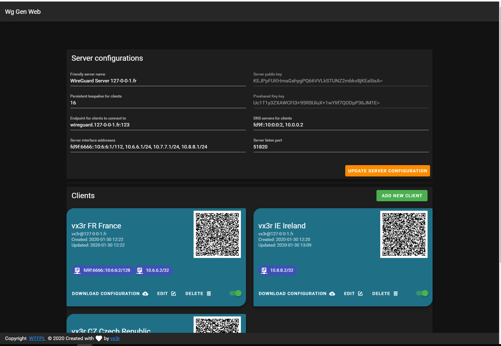

# Wg Gen Web

Simple Web based configuration generator for [WireGuard](https://wireguard.com).

---

<p align="left">
    <a href="https://goreportcard.com/report/github.com/vx3r/wg-gen-web"></a>
    <a href="https://gitlab.127-0-0-1.fr/vx3r/wg-gen-web/commits/master"></a>
</p>

## Whay another one ?

All WireGuard UI implementations are trying to manage the service by applying configurations and creating network rules.
This implementation only generate configuration and its up to you to create network rules and apply configuration to WireGuard.
For example by monituring generated directory with [inotifywait](https://github.com/inotify-tools/inotify-tools/wiki). 

The goal is to run Wg Gen Web in a container and WireGuard on host system.

## Features

 * Self-serve and web based
 * Automatically select IP from networks chosen for client
 * QR-Code for convenient mobile client configuration
 * Enable / Disable client
 * Generation of `wg0.conf` after any modification
 * Dockerized
 * Pretty cool look


## Running

The easiest way to run Wg Gen Web is using the container image
```
docker run --rm -it -v /tmp/wireguard:/data -p 8080:8080 -e "WG_CONF_DIR=/data" vx3r/wg-gen-web:latest
```
Docker compose snipped
```
version: '3.6'
services:
  wg-gen-web:
    image: vx3r/wg-gen-web:latest
    container_name: wg-gen-web
    restart: unless-stopped
    expose:
      - "8080/tcp"
    environment:
      - WG_CONF_DIR=/data
      - WG_INTERFACE_NAME=wg0.conf
    volumes:
      - /mnt/raid-lv-data/docker-persistent-data/wg-gen-web:/data
```
## How to trigger WireGuard on host

Before going further create a symlink from docker mounted volume to `/etc/wireguard`
```
ln -s /mnt/raid-lv-data/docker-persistent-data/wg-gen-web /etc/wireguard
```

### Example with ```systemd```
Using `systemd.path` monitor for directory changes see [systemd doc](https://www.freedesktop.org/software/systemd/man/systemd.path.html)
```
# /etc/systemd/system/wg-gen-web.path
[Unit]
Description=Watch /etc/wireguard for changes

[Path]
PathModified=/etc/wireguard

[Install]
WantedBy=multi-user.target
```
This `.path` will activate unit file with the same name
```
# /etc/systemd/system/wg-gen-web.service
[Unit]
Description=Restart WireGuard
After=network.target

[Service]
Type=oneshot
ExecStart=/usr/bin/systemctl restart wg-quick@wg0.service

[Install]
WantedBy=multi-user.target
```
Which will restart WireGuard service 

### Example with ```inotifywait```
Using whatever init system create a daemon running this script
```
#!/bin/sh
while inotifywait -e modify -e create /etc/wireguard; do
  wg-quick down wg0
  wg-quick up wg0
done
```

## What is out of scope

 * Generation or application of any `iptables` or `nftables` rules
 * Application of configuration to WireGuard

## TODO

 * Multi-user support behind [Authelia](https://github.com/authelia/authelia) (suggestions / thoughts are welcome)
 * Send configs by email to client
 
## License

 * Do What the Fuck You Want to Public License. [LICENSE-WTFPL](LICENSE-WTFPL) or http://www.wtfpl.net
